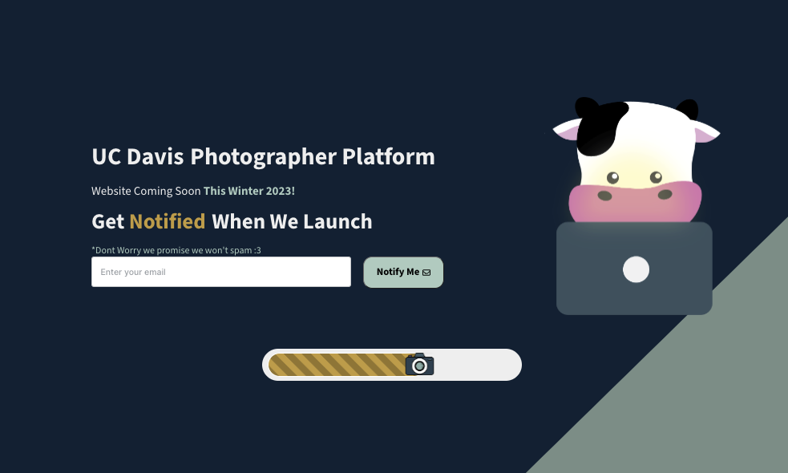

# DavisPNG Frontend

## Table of Contents

- [Introduction](#introduction)
- [Live Demo](#live-demo)
- [Features](#features)
- [Tools and Frameworks Used](#tools-and-frameworks-used)
- [Contributing](#contributing)
- [Credits](#credits)

## Introduction

DavisPNG is a website marketplace created with the purpose of linking photographers to students, emphasized by the need of availability during graduation. The website application is still under development! This repository contains the frontend side of our website application. To view our backend, visit: <a href = "https://github.com/Roszillary/DavisPNG_backend" target="_blank"> DavisPNG Backend </a>

## Live Demo

Experience the live version and sign up for when we deploy our whole application here: <a href="https://davispng.com/" target = "_blank"> davispng.com </a>

## Features

### Home Page

The landing page to introduce what our website is targeted and created for.

### Sign Up Page

The website is still under development but input your email so that we can get back to you when we deploy!

## Tools and Frameworks Used:

- **Firebase**: Hosting services for the deployed website.
- **React.js**: The core framework used to build the user interface.
- **HTML/SCSS**: Markup and styling languages used for creating web pages with styled components.

## Credits

- Teeranade Cheng (Win) - Initial Work: <a href="https://www.linkedin.com/in/teeranade-cheng/" target = "_blank">LinkedIN</a>
- Khunanya Liu (Yaya) - UIUX Designer: <a href="https://www.linkedin.com/in/khunanya-liu/" target = "_blank"> LinkedIN</a>
- John Carraher - UIUX Designer:
- Chen Yi - Front-end: <a href="https://github.com/cyzhoutt" target = "_blank">Github</a>
